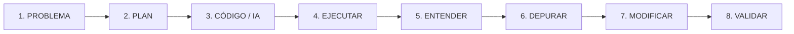

# 01 · GUÍA GENERAL DEL CURSO: PROGRAMAR EN 2027

## 1. Visión Global del Itinerario

El curso **"Programar en 2027"** es un programa formativo modular desarrollado para la **Red de Centros Circular FAB**: un curso en castellano para aprender a programar con Python como lenguaje principal, avanzando desde fundamentos y proyectos reales hasta debugging, validación, Git, trabajo con IA y agentes bajo revisión humana. Principio: la IA puede ayudar, proponer y modificar; la persona entiende, revisa, prueba y decide.

Su propósito es capacitar a ciudadanos, emprendedores, técnicos y profesionales en el uso de Python como herramienta de computación moderna, automatización, análisis de datos y desarrollo de software asistido por Inteligencia Artificial generativa.

### Objetivos Generales
1. **Desmitificar la programación:** Transformar la barrera técnica inicial en una habilidad práctica accesible mediante entornos interactivos inmediatos (Google Colab / Jupyter Notebooks).
2. **Dominar las estructuras esenciales del lenguaje:** Comprender la lógica algorítmica, las colecciones de datos, el paradigma funcional/modular y los fundamentos de la Programación Orientada a Objetos (POO).
3. **Manejar datos y automatización:** Usar NumPy, Pandas y ReportLab en SAMI-Applied a partir de CSV local; conocer Playwright en los materiales de automatización de B5.
4. **Dar el salto al entorno profesional:** Migrar con soltura del cuaderno interactivo a proyectos locales estructurados en Visual Studio Code, con entornos virtuales (`venv`), gestión de paquetes (`pip`) y control de versiones básico (`Git`).
5. **Gobernar el desarrollo asistido por IA (2027):** Integrar asistentes y modelos de lenguaje como copilotos de programación bajo un protocolo estricto de auditoría y validación crítica, erradicando el "desarrollo zombi".

---

## 2. Metodología Pedagógica: "Aprender Haciendo"

El curso destierra las clases magistrales extensas y adopta un enfoque de **aprendizaje activo basado en retos iterativos**:

```
[Explicación breve (3-5 min)] ➔ [Ejemplo mínimo ejecutable] ➔ [Ejecución en vivo] ➔ [Modificación guiada] ➔ [Predicción de salida] ➔ [Mini-Reto individual] ➔ [Comprobación]
```

### El Flujo Crítico de Trabajo 2027 (Asistido por IA)
En la era actual, programar no consiste en memorizar sintaxis, sino en orquestar soluciones y validar código:



1. **Problema:** Definir claramente qué se quiere resolver en lenguaje natural y reglas de negocio.
2. **Plan:** Diseñar la arquitectura lógica (entradas, pasos de procesamiento, estructuras de datos y salidas).
3. **Código / IA:** Redactar el código manualmente o solicitarlo a la IA mediante un prompt estructurado y acotado.
4. **Ejecutar:** Correr el script en el entorno real (consola / Colab / VS Code).
5. **Entender:** Analizar qué hace cada línea antes de aceptarla.
6. **Depurar:** Leer el *Traceback*, localizar excepciones o errores de lógica.
7. **Modificar:** Ajustar el código para satisfacer requerimientos específicos o casos de borde.
8. **Validar:** Ejecutar baterías de pruebas con datos extremos y verificar la ausencia de efectos secundarios.

### Metodología "Anti-Zombi"
Se denomina **programador zombi** a quien copia y pega fragmentos de código autogenerados por IA sin comprender su funcionamiento, sin saber depurarlos cuando fallan y sin poder justificar sus decisiones de diseño. El curso implementa una evaluación continua basada en **defensa oral, predicción de salidas y lectura crítica de trazas de error**.

---

## 3. Mapa Curricular del Curso (B1 a B7)

La ruta publicada empieza en los [inicios de los bloques](../inicio.html). B1-B5 ofrecen cuadernos prácticos y B3-B5 copias de proyectos; B6 y B7 se organizan en seis experiencias cada uno. El [mapa de recursos de 04](04-PRACTICAS-Y-APOYOS.md) enlaza esas entradas. Las duraciones de 150/90/60/30 minutos de las guías son adaptaciones, no sustituyen las duraciones de cada página.

El siguiente esquema resume la progresión en un único recorrido: SAMI es el proyecto conductor de B3 a B7 y los agentes son la vía avanzada para intervenir sobre ese mismo SAMI en B7.

```
[B1: Fundamentos y Lógica]
        │
        ▼
[B2: Estructuras de Datos] ──► [Proyecto B2: Clasificador e Indexador de Palabras]
        │
        ▼
[B3: Funciones y Modularidad] ──► [Proyecto B3: SAMI-Lite (Persistencia JSON/CSV)]
        │
        ▼
[B4: Programación Orientada a Objetos] ──► [Proyecto B4: SAMI-OOP (Clases y Herencia)]
        │
        ▼
[B5: Python Aplicado y Librerías] ──► [Proyecto B5: SAMI-Applied (CSV, NumPy, Pandas, PDF)]
        │
        ▼
[B6: Del Notebook al Entorno Profesional] ──► [Proyecto B6: SAMI-Local (VS Code, venv, Git, Debugger)]
        │
        ▼
[B7: Python + IA] ──► [Harness, agente real, LangGraph e IA-Control]
        │
        └─► [Ingeniería histórica: SAMI Final y orquestación conversacional avanzada]
```

---

## 4. Tabla Sinóptica de los 7 Bloques

| Bloque | Título y Enfoque | Entorno | Conceptos Centrales | Proyecto / Hito |
| :--- | :--- | :--- | :--- | :--- |
| **B1** | **Fundamentos y Lógica**<br>Primeros programas en notebook | Google Colab / Notebook | `print()`, variables, tipos (`str`, `int`, `float`, `bool`), `divmod()`, casting, `input()`, f-strings, `if/elif/else`, bucles `for`/`while`, `range()`, `break`, `continue`. | Prácticas 01 a 04: operaciones, tramos de precios, cálculo de medias y bucles interactivos. |
| **B2** | **Estructuras de Datos**<br>Colecciones y manipulación | Google Colab / Notebook | Cadenas (slicing bidireccional y reversión), listas y mutabilidad, tuplas (inmutabilidad), sets (unicidad y teoría de conjuntos), diccionarios (claves y `.get()`), comprehensions. | **Clasificador e Indexador de Palabras Clave** (análisis de texto y conteo estructurado). |
| **B3** | **Funciones y Modularidad**<br>Programas reutilizables | Colab / Scripts `.py` | `def`, `return` frente a `print()`, parámetros opcionales por defecto, scope local vs global, docstrings, `try-except-else-finally`, `with open()`, JSON nativo, CSV, `import`. | **SAMI-Lite**: Gestor modular de datos de consola con persistencia física en JSON/CSV. |
| **B4** | **POO (Orientada a Objetos)**<br>Modelado robusto | Colab / VS Code | Clases vs instancias, `__init__`, `self`, métodos de instancia, atributos públicos y privados (convención `_`), composición ("tiene un"), herencia ("es un"), `super()`, polimorfismo. | **SAMI-OOP**: Refactorización completa del sistema a arquitectura de clases jerárquicas y polimórficas. |
| **B5** | **Python Aplicado y Librerías**<br>Ecosistema de datos | Colab / VS Code | NumPy (arrays `ndarray`, operaciones vectorizadas, estadísticas), Pandas (Series, DataFrames, filtros booleanos, dataset GoT `got_1.csv` como práctica didáctica), Playwright (automatización web), ReportLab Platypus (generación real de PDF). | **SAMI-Applied**: CSV de hardware → Pandas/NumPy → ReportLab. Playwright queda fuera del flujo de este proyecto. |
| **B6** | **Trabajo como developer**<br>Desarrollo local | VS Code Local | De `.ipynb` a scripts `.py`, terminal integrada, entornos virtuales (`python -m venv`), gestión con `pip` y `requirements.txt`, control de versiones (`Git/GitHub`), debugger interactivo de VS Code. | **SAMI-Local**: Estructura de paquete profesional en disco local con repositorio Git, virtualenv y depuración con breakpoints. |
| **B7** | **Python + IA**<br>Desarrollo asistido y validación | VS Code + LLMs | Flujo de desarrollo asistido 2027, prompts estructurados para código, auditoría crítica de IA, depuración asistida, refactorización segura, plan de validación. LangGraph ejecutable sin LLM e IA-Control con Ollama opcional. | **SAMI Final como proyecto conductor**; vía avanzada con agentes sobre ese mismo SAMI: tarea acotada → contexto → `status`/`diff` → ejecutar → comprobar → ACEPTAR/MODIFICAR/RECHAZAR. |

---

## 5. El Eje Vertebrador: La Progresión SAMI

**SAMI** se presenta como Sistema de Auditoría de Precios y Generación Automatizada de Reportes de Mercado.

1. **B3 · SAMI-Lite:** funciones y módulos para calcular precios, evaluar alertas y registrar transacciones en CSV, con configuración JSON y log.
2. **B4 · SAMI-OOP:** productos, hardware y licencias; composición en AuditoriaMercado y persistencia en ManejadorDatos.
3. **B5 · SAMI-Applied:** CSV local de hardware, análisis con Pandas/NumPy y PDF con ReportLab Platypus.
4. **B6 · SAMI-Local:** copia personal para orientarse, preparar entorno, depurar, modificar y guardar un cambio con Git.
5. **B7 · SAMI Final:** cierre del proyecto con programación asistida crítica y, como vía avanzada, intervenciones de agentes sobre el mismo SAMI con revisión y decisión humanas.

Consulta [06 · SAMI](06-SAMI.md) para las diferencias entre versiones. No atribuyas a una copia los archivos, las clases ni los resultados de otra.

## 6. Lab · Programar en Acción: pathway y laboratorios

[Programar en Acción](../lab-python-en-accion/index.html) es una continuación práctica independiente: vitrina opcional para experimentar y ampliar, no B8, sin requisitos evaluables por defecto.

El portal contiene un pathway desde agentes y API hasta datos persistentes, interfaces, contexto conectado e IA controlada, además de laboratorios como OpenCV, Pillow, archivos, Excel, Tkinter y RAG local. Consulta [08 · Mapa y apoyos](08-LAB-PYTHON-EN-ACCION.md) y los prerrequisitos de cada experiencia.

Las cinco fichas originales siguen siendo útiles; ya no representan todo el recurso. No deduzcas el catálogo a partir de un subtítulo numérico antiguo.

---

## 7. Contexto de Aplicación en la Red Circular FAB

Los talleres de la Red Circular FAB se caracterizan por una gran diversidad de perfiles de alumnado (desde personas sin experiencia previa hasta perfiles técnicos que buscan actualizarse). 

Por ello, el formador debe:
* **Fomentar la autonomía:** Que los alumnos lean los errores de consola antes de pedir ayuda inmediata.
* **Contextualizar los ejercicios:** Relacionar los problemas con la gestión de talleres, control de inventarios, sensores de fabricación digital, monitorización de recursos y análisis de datos locales.
* **Ajustar el ritmo con flexibilidad:** Utilizar las adaptaciones temporales (150 min estándar, 90 min intensivo, 60 min compacto o 30 min cápsula) según la convocatoria.
